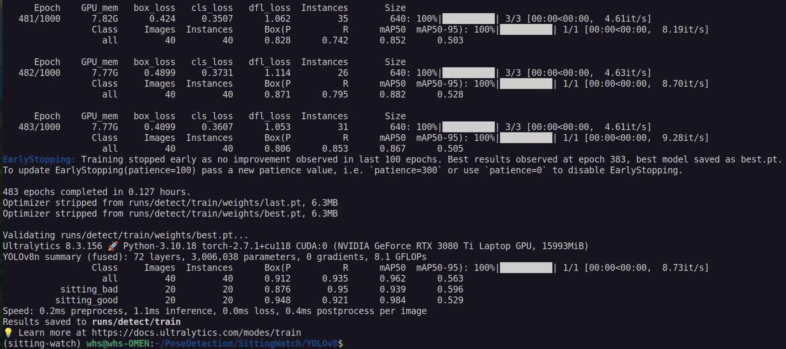

# SittingWatch

## Introduction

**NOTE:** The directory `YOLOv8` was downloaded from `https://github.com/ultralytics/ultralytics`, which is then modified slightly.

## Project Structure

## Testing Environment

The project has been tested in the following environment.

| Item | Detail |
| ---- | ---- |
| Platform | HP OMEN 17 2022 |
| OS | Ubuntu 22.04 LTS |
| CPU | Intel Core i7-12800HX |
| GPU | NVIDIA GeForce RTX 3080 Ti Laptop (16GB) |
| CUDA | 11.8 |
| Memory | 32GB RAM |
| Disk | 2TB SSD |

## Installation Guide

First, create a virtual environment using Anaconda (recommended).

```bash
conda create -n sitting-watch python=3.10 -y
conda activate sitting-watch
```

Second, install PyTorch that suits your own device through `https://pytorch.org/get-started/locally/`. The code has been tested on version `2.7.1`.

Third, install the dependencies using the following commands.

```bash
cd path/to/SittingWatch
pip install -r requirements.txt
```

To finish installation, install `ultralytics` through `pip`.

```bash
pip install ultralytics
```

## Backend Service

## Further Details

### Inference without Backend

### Data Preparation

### Training Guide

First, enter the `YOLOv8` directory.

```bash
cd YOLOv8
```

Second, place the datasets in `path/to/SittingWatch/YOLOv8/main/datasets/sitting_pose` and adjust `data.yaml` according to your local environment. Mind that the dataset should be in YOLO format, which is described below.

```
.
└── sitting_pose
    ├── data.yaml
    ├── test
    │   ├── images
    │   └── labels
    ├── train
    │   ├── images
    │   ├── labels
    └── valid
        ├── images
        └── labels
```

Then, select a set of appropriate hyperparameter and start training.

```bash
yolo detect train data=main/datasets/sitting_pose/data.yaml model=yolov8n.yaml pretrained=yolov8n.pt epochs=1000 batch=64 lr0=0.0001
```

The result should be something like below.



